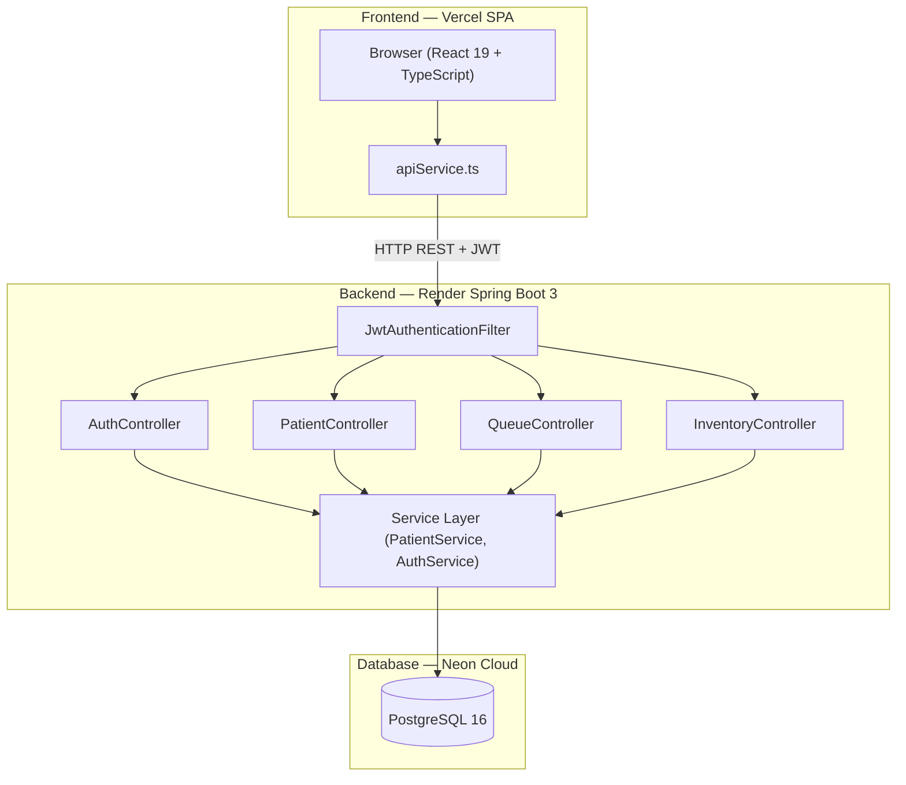

# 🩺 MediScript — Enterprise Clinic & EHR System

[](https://react.dev/)
[](https://spring.io/projects/spring-boot)
[](https://neon.tech/)
[](https://jwt.io/)
[](https://vercel.com/)

MediScript is a production-grade, multi-tenant Clinic & EHR Management System built with **React 19**, **TypeScript**, **Spring Boot 3.3**, and **PostgreSQL (Neon)**. It provides end-to-end clinical workflows including patient registration, OPD queue management, AI-assisted prescription generation, pharmacy stock tracking, BCrypt/JWT security, and multi-branch isolation.

---

## 🌐 Live Deployments

- 🌐 **Live Web Application**: [MediScript Frontend on Vercel](https://ai-projects-95db6tbmg-mahdi-f242.vercel.app)
- ⚙️ **Production REST API**: [MediScript Backend on Render](https://mediscript-api.onrender.com/)
- 📖 **Interactive API Specs**: [Swagger OpenAPI Documentation](https://mediscript-api.onrender.com/swagger-ui/index.html)

---

## 🔑 Demo Login Credentials

For recruiters, reviewers, and live testers:

| Portal Tab | Username | Password | Role | Access Level |
|---|---|---|---|---|
| **Admin** | `mahdi` | `admin123` | **ADMIN** | Super Admin Control Panel, Doctor Management |
| **Doctor** | `farid` | `password123` | **DOCTOR** | Dr. Farid Ansari's OPD Queue & Patient Records |
| **Doctor** | `shoeb` | `password123` | **DOCTOR** | Dr. Shoeb's OPD Queue & Patient Records |

---

## ✨ Key Features

- 🔐 **BCrypt & JWT Authentication**: Server-side BCrypt password hashing with 24-hour signed JWT tokens.
- 👨‍⚕️ **Multi-Tenant Data Isolation**: Super Admins retain global visibility; Doctors access only their assigned patients.
- 📋 **OPD Queue & Vitals**: Real-time waiting list, token generator, vitals tracking, and printable queue slips.
- 💊 **AI Prescription & Visit Recorder**: Quick consultation entry, Gemini AI symptom analysis, lab orders, and printable prescription receipts.
- 📦 **Pharmacy Stock Inventory**: Real-time medicine stock tracking, batch management, low-stock alerts, and pricing.
- 🏬 **Multi-Branch Management**: Clinic branch registry with doctor counts and regional configurations.
- 🔄 **Flyway DB Migrations**: Structured SQL schema versioning for zero-downtime database upgrades.
- 🐳 **Full Dockerization**: Multi-stage Dockerfiles for frontend, backend, and PostgreSQL orchestration.

---

## 🏛️ System Architecture



---

## 🛠️ Tech Stack & Architecture

- **Frontend**: React 19, TypeScript, Vite, Tailwind CSS, Lucide Icons, React Router 7
- **Backend**: Java 17, Spring Boot 3.3.5, Spring Security, Spring Data JPA, Hibernate, JJWT
- **Database**: PostgreSQL 16 (Neon Cloud) / H2 In-Memory (Dev Profile), Flyway Migrations
- **AI Integration**: Google Gemini 2.5 Flash
- **DevOps**: Docker, Docker Compose, Render (Backend API), Vercel (Frontend SPA)

---

## 💻 Local Development Setup

### Prerequisites
- JDK 17+
- Node.js 18+
- Maven 3.9+ (or use embedded `./mvnw`)

### 1. Backend Setup
```bash
cd backend
# Run with H2 in-memory database (zero database installation required)
./mvnw spring-boot:run "-Dspring-boot.run.profiles=h2"
```
Backend API will start at `http://localhost:8080`.

### 2. Frontend Setup
```bash
cd frontend
npm install
npm run dev
```
Frontend Web App will open at `http://localhost:3000`.

---

## 📄 License

This project is open-source under the [MIT License](LICENSE).
