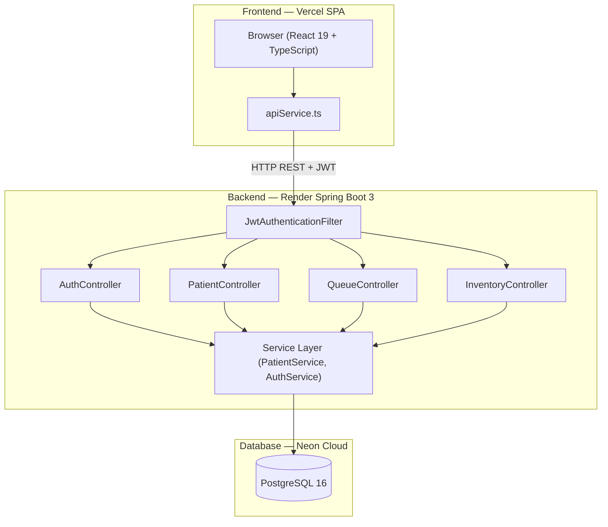

# 🩺 MediScript — Enterprise Clinic & EHR System

[](https://react.dev/)
[](https://spring.io/projects/spring-boot)
[](https://neon.tech/)
[](https://jwt.io/)
[](https://vercel.com/)

MediScript is a production-grade, multi-tenant Clinic & EHR Management System built with **React 19**, **TypeScript**, **Spring Boot 3.3**, and **PostgreSQL (Neon)**. It provides end-to-end clinical workflows including patient registration, OPD queue management, AI-assisted prescription generation, pharmacy stock tracking, BCrypt/JWT security, and multi-branch isolation.

---

## 🌐 Live Deployments

- 🌐 **Live Web Application**: [MediScript Frontend on Vercel](https://ai-projects-95db6tbmg-mahdi-f242.vercel.app)
- ⚙️ **Production REST API**: [MediScript Backend on Render](https://mediscript-api.onrender.com/)
- 📖 **Interactive API Specs**: [Swagger OpenAPI Documentation](https://mediscript-api.onrender.com/swagger-ui/index.html)

---

## 🔑 Demo Access & Role Accounts

For reviewers, recruiters, and live testers:

| Portal Tab | Username | Access & Role | Description |
|---|---|---|---|
| **Admin** | `mahdi` | **ADMIN (Super Admin)** | Super Admin Control Panel, Doctor Onboarding, Multi-Branch Management |
| **Doctor** | `farid` | **DOCTOR (Practitioner)** | Dr. Farid Ansari's OPD Queue, Patient Directory, Visit Recorder |
| **Doctor** | `shoeb` | **DOCTOR (Practitioner)** | Dr. Shoeb's OPD Queue, Patient Directory, Visit Recorder |

> *Note: Demo passwords available upon request or via automated seed environment.*

---

## ⚡ Engineering Highlights

- 🔐 **BCrypt Password Hashing**: Server-side salted hash password protection using Spring Security `BCryptPasswordEncoder`.
- 🎟️ **Stateless JWT Tokens**: 24-hour signed JSON Web Tokens (`JJWT`) with claims-based access.
- 🏗️ **Service Layer Architecture**: Decoupled design separating REST controllers from JPA repository business logic.
- 👨‍⚕️ **Multi-Tenant Data Isolation**: Multi-tenant data segregation ensuring doctors only access their assigned patients while admins retain system-wide visibility.
- 📋 **OPD Queue & Vitals**: Real-time waiting list, token generator, vitals tracking, and printable queue slips.
- 💊 **AI Prescription & Visit Recorder**: Quick consultation entry with Gemini AI clinical assistance, lab orders, and printable prescription receipts.
- 📦 **Pharmacy Stock Inventory**: Real-time medicine stock tracking, batch management, low-stock alerts, and pricing.
- 🔄 **Flyway Database Migrations**: Structured SQL schema versioning (`V1__init_schema.sql`) for zero-downtime database upgrades.
- 🐳 **Full Containerization**: Multi-stage Dockerfiles for frontend, backend, and PostgreSQL orchestration.

---

## 📁 Project Structure

```text
mediscript---clinic-management-system/
├── frontend/                     # React 19 + TypeScript + Vite SPA
│   ├── components/               # Reusable UI components (Layout, Modals, Buttons)
│   ├── pages/                    # Page components (Dashboard, DoctorQueue, PatientList, etc.)
│   ├── services/                 # API service layer (apiService.ts, geminiService.ts)
│   ├── types.ts                  # TypeScript interfaces and domain models
│   ├── Dockerfile                # Multi-stage Nginx production container
│   └── vercel.json               # Vercel SPA rewrite configuration
│
├── backend/                      # Spring Boot 3.3.5 Backend REST API
│   ├── src/main/java/com/mediscript/clinic/
│   │   ├── config/               # SecurityConfig, CorsConfig
│   │   ├── controller/           # REST Controllers (Auth, Patient, Queue, Inventory, etc.)
│   │   ├── model/                # JPA Entities (User, Patient, Visit, QueueItem, etc.)
│   │   ├── repository/           # Spring Data JPA Repositories
│   │   ├── security/             # JwtUtils, JwtAuthenticationFilter
│   │   └── service/              # Business Service Layer (PatientService, AuthService)
│   ├── src/main/resources/       # application.properties & Flyway SQL migrations
│   ├── src/test/java/            # JUnit 5 + Mockito Unit Tests
│   └── Dockerfile                # Multi-stage Maven JRE production container
│
├── docker-compose.yml            # Multi-container orchestration (PostgreSQL + Backend + Frontend)
└── README.md                     # Project documentation
```

---

## 📡 API Request & Response Examples

### Authentication Endpoint: `POST /api/auth/login`

**Request:**
```http
POST /api/auth/login HTTP/1.1
Host: mediscript-api.onrender.com
Content-Type: application/json

{
  "username": "mahdi",
  "password": "••••••••"
}
```

**Response (`200 OK`):**
```json
{
  "id": "1",
  "username": "mahdi",
  "name": "Mahdi (Super Admin)",
  "specialization": "System Administrator & Owner",
  "licenseNumber": "ADMIN-001",
  "role": "ADMIN",
  "status": "ACTIVE",
  "token": "eyJhbGciOiJIUzUxMiJ9.eyJzdWIiOiJtYWhka..."
}
```

---

## 🏛️ System Architecture



---

## 🗺️ Roadmap & Future Enhancements

- 📅 **Appointment Scheduling & Calendar**: Online patient appointment booking with calendar slots.
- 💳 **Billing & Automated Invoicing**: PDF invoice generation and digital payment integration.
- 📱 **SMS / WhatsApp Notifications**: Automated appointment reminders and token queue updates.
- 📑 **PDF Prescription Export**: One-click downloadable PDF prescriptions.
- 📊 **Advanced Analytics & Reporting**: Financial revenue tracking and patient demographics analytics.

---

## 💻 Local Development Setup

### Prerequisites
- JDK 17+
- Node.js 18+
- Maven 3.9+ (or embedded `./mvnw`)

### 1. Backend Setup
```bash
cd backend
# Run with H2 in-memory database (zero database installation required)
./mvnw spring-boot:run "-Dspring-boot.run.profiles=h2"
```
Backend API will start at `http://localhost:8080`.

### 2. Frontend Setup
```bash
cd frontend
npm install
npm run dev
```
Frontend Web App will open at `http://localhost:3000`.

---

## 📄 License

This project is open-source under the [MIT License](LICENSE).
